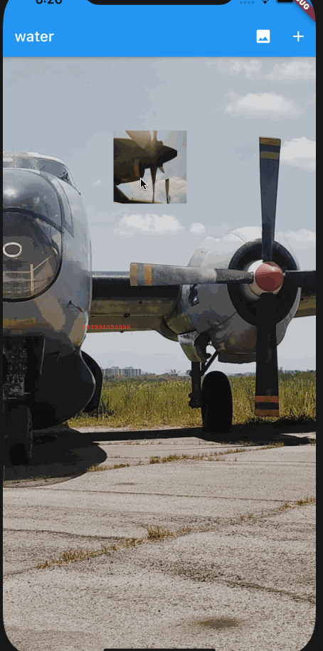

# zlwatermark

flutter 添加水印

## Usage


```dart
class WaterPage extends StatefulWidget {
  @override
  _WaterPageState createState() => _WaterPageState();
}

class _WaterPageState extends State<WaterPage> {
  List<Widget> list = [];

  @override
  Widget build(BuildContext context) {
    return Scaffold(
      appBar: AppBar(
        title: Text("water"),
        actions: [
          IconButton(icon: Icon(Icons.image), onPressed: () {
            list.add(Image.asset("assets/gallery1.jpg", width: 100, height: 100, fit: BoxFit.cover,));
            setState(() {
            });
          }),
          IconButton(icon: Icon(Icons.add), onPressed: () {
            list.add(Text("aaaaaaaaaaaa", style: TextStyle(fontSize: 10, color: Colors.red),),);
            setState(() {
            });
          })
        ],
      ),
      body: Column(
        crossAxisAlignment: CrossAxisAlignment.center,
        mainAxisAlignment: MainAxisAlignment.center,
        children: [
          ZLWaterView(
            size: Size(400, 700),
            child: Image.asset("assets/gallery3.jpg", fit: BoxFit.cover,),
            children: list,
          )
        ],
      ),
    );
  }
}

```
